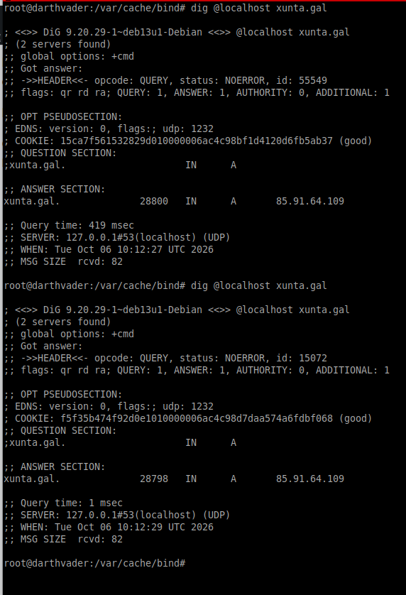
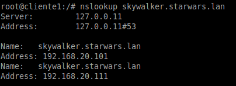
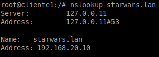
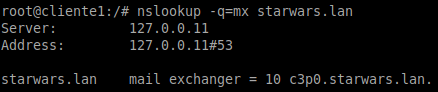
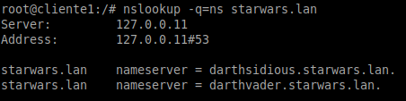
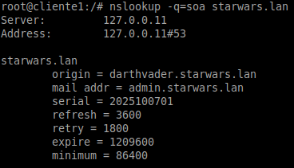
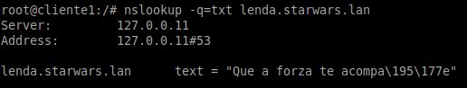
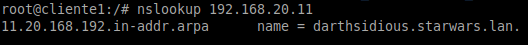

1.Instala o servidor BIND9 no equipo darthvader. Comproba que xa funciona coma servidor DNS caché pegando no documento de entrega a saída deste comando dig @localhost xunta.gal 

Esta es la salida que devolvió el comando:

Se puede ver que en el primer dig el Query Time fue de 419 ms y en cambio en el segundo fue de 1ms. Eso quiere decir que el servidor DNS está configurado en modo caché. Esto se debe a que en la primera isntrucción el servicio DNS fue a preguntar a Internet, y en la segunda respondió desde la memoria.

---

nslookup darthvader.starwars.lan

nslookup skywalker.starwars.lan

nslookup starwars.lan

nslookup -q=mx starwars.lan

nslookup -q=ns starwars.lan

nslookup -q=soa starwars.lan

nslookup -q=txt lenda.starwars.lan

nslookup 192.168.20.11

